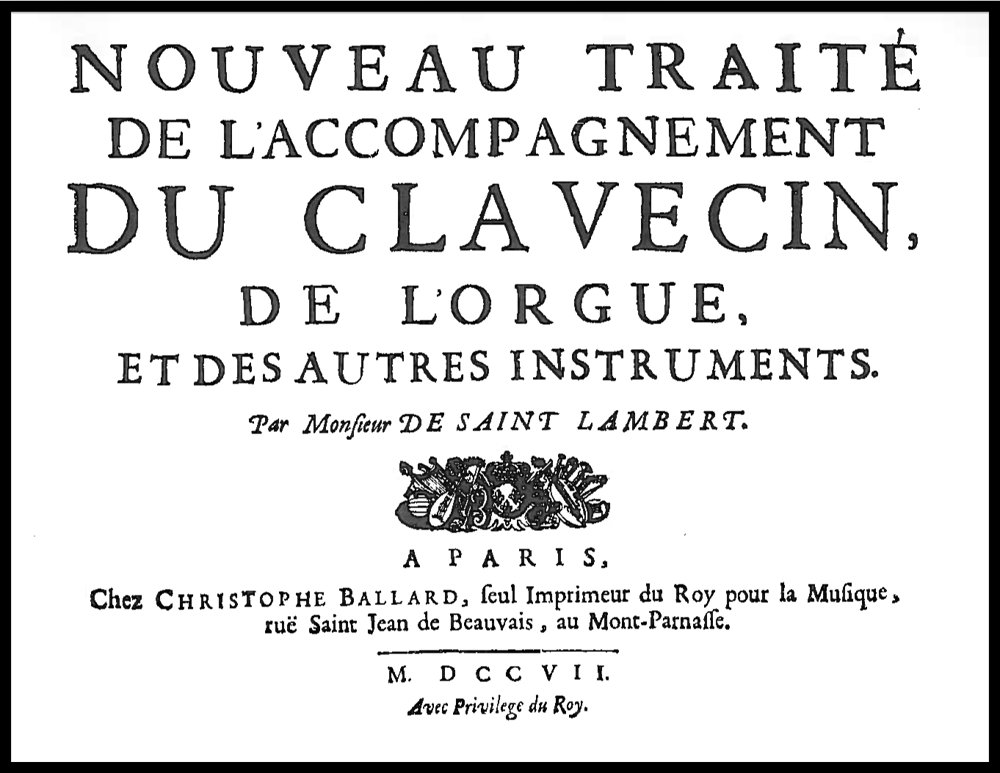

#########
Rule sets
#########
This page lists the rule sets and rules included in the Figure Divination
program.

Saint Lambert Rule Set
========================

.. automodule:: rulesets.ruleset_SL
    :members:
    :exclude-members: full_ruleset

    To test these rules against the examples for each rule given by Saint
    Lambert in his treatise, use :mod:`test_rulesSL`. To run from the command
    line, use ::

        python test_rulesSL.py [-r rule_numbers]

    where rule_numbers correspond to rules in the set, e.g. to get all variants
    of rules 24 (24a, 24b1, 24b2, 24c) use ::

        python test_rulesSL.py -r 24

    For full command line option flags, use ::

        python test_rulesSL.py -h

    Saint Lambert Rules
    -------------------